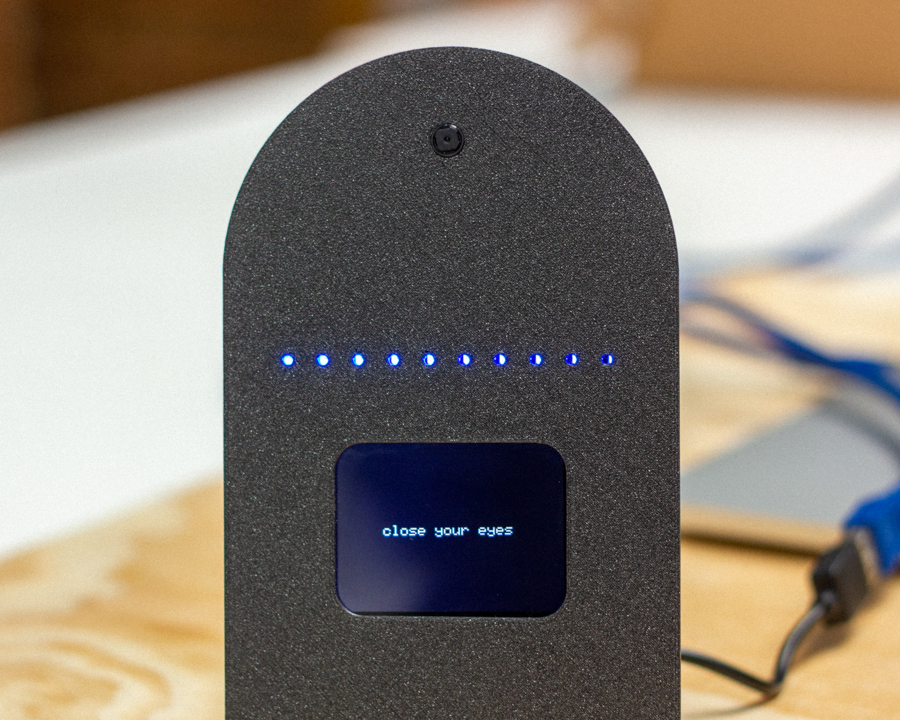
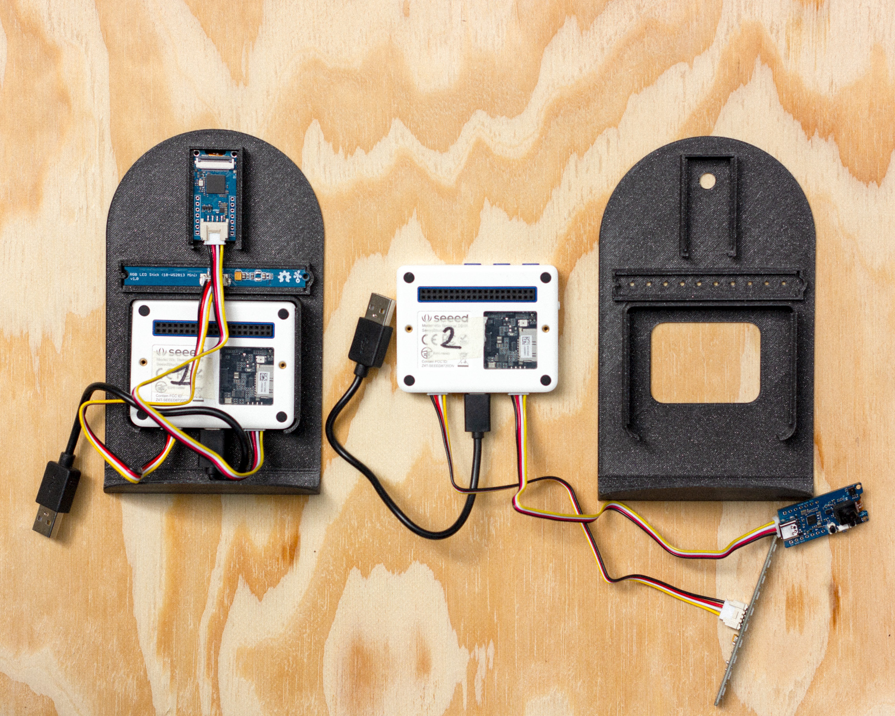
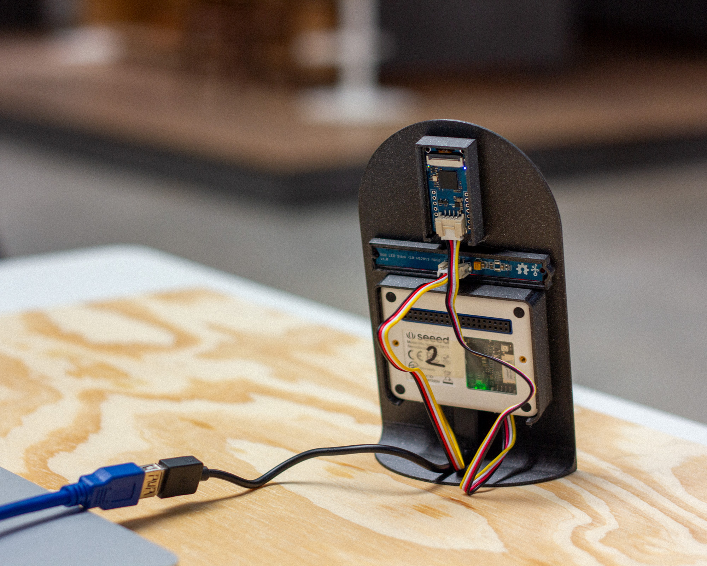
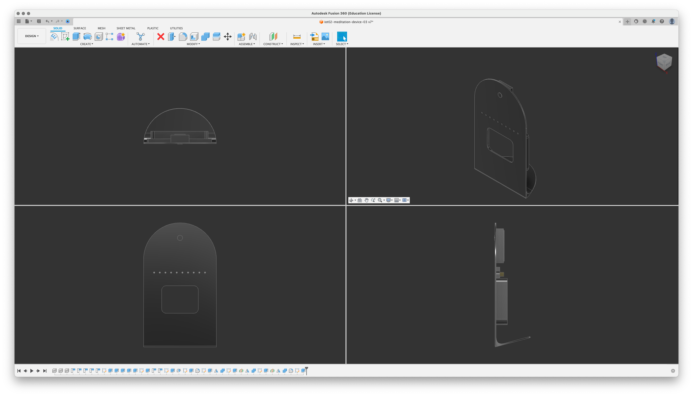
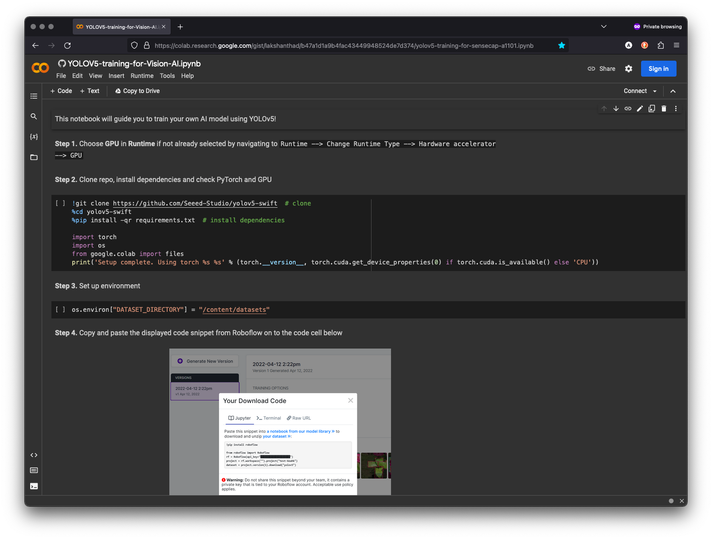
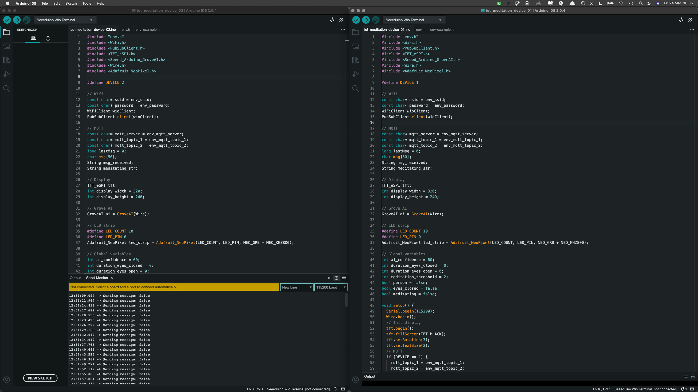
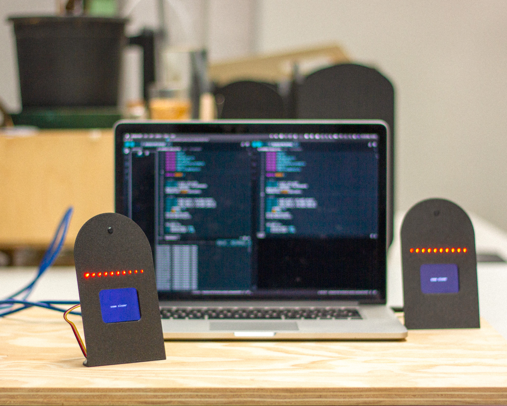
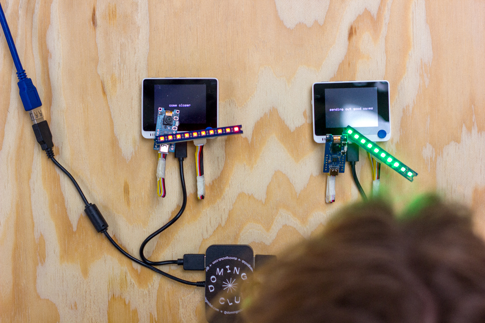
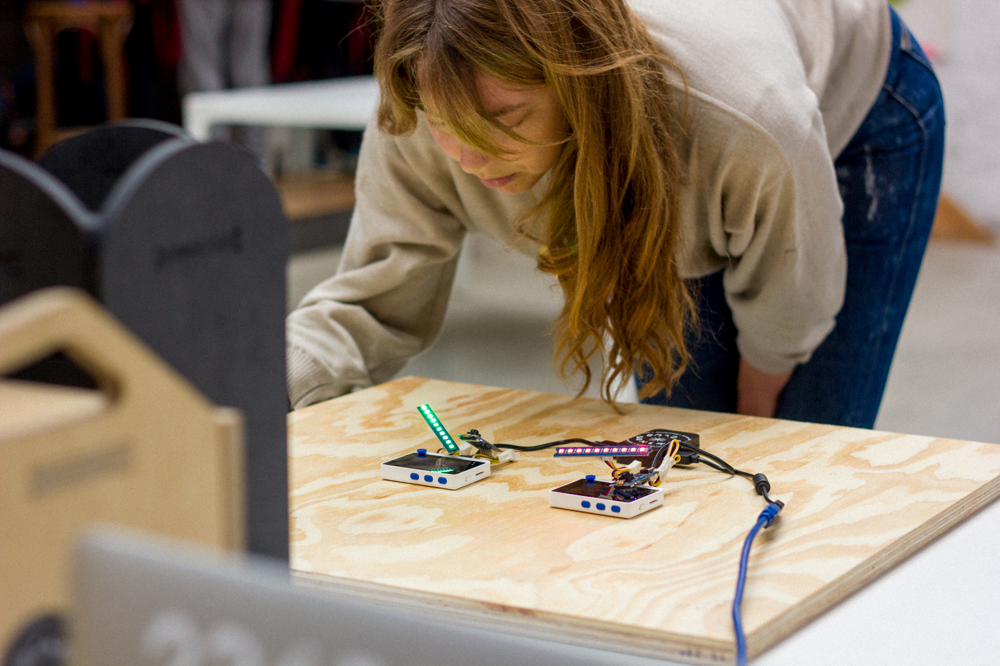
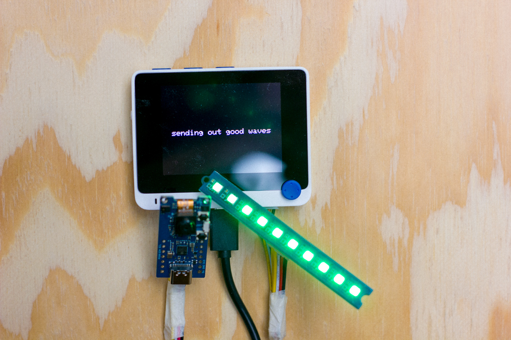

# Meditation Link

Meditation Link invites participants to close their eyes and meditate. This object, equipped with a camera, analyses the participants to detect their level of meditation and communicates from one object to another, inviting others to join a collective meditation.

````
This project is open-source and designed to be built and deconstructed, learned and re-appropriated.
````


*Meditation Link, a tool for teaching and questioning technology*


## Hardware

### Components

- Seeed Studio Wio Terminal
- Grove AI Vision
- Grove RGB LED Stick
- [3D-printed support](iot-meditation-link-support.stl)

### Assembly instructions

1. 3D print the enclosure
2. Connect the Grove AI vision on the left port of the Wio Terminal
3. Connect the RGB LED Stick on the right port of the Wio Terminal
4. Fit the camera, terminal and LED to the [3D-printed support](iot-meditation-link-support.stl)
5. Power the Wio Terminal with a USB-C cable



*Assembly, mounted and unmounted*


*Assembly, back side*


*3D design in Fusion 360*


## Software

### AI Camera

#### Resources

1. [Google Collab Sketch](https://colab.research.google.com/gist/lakshanthad/b47a1d1a9b4fac43449948524de7d374/yolov5-training-for-sensecap-a1101.ipynb)
2. [Images dataset](https://universe.roboflow.com/112fkdldjs-gmail-com/eye_open-and-close-test-2/browse?queryText=&pageSize=50&startingIndex=0&browseQuery=true)


#### Method

For the camera to recognise what we want it to recognise, we need to train it with classified images. For this project we chose the image set of open or closed eyes, in order to deduce whether a person is meditating or not.

A relatively complicated code and the installation of a multitude of tools are required to train the AI model. We are not going to do this on our own computer but rather directly on a Google computer in a pre-configured environment. The image set is on Roboflow. We will use this website for our images. Creating an account is necessary.



- Click on the [ ] at the top right of each block, one by one, to execute the code. Wait for the end of a block before starting the next one.
- For step 4, you will need the download code from the Roboflow dataset page. To get it, click on Export and copy the code.
- The step 6 is the longest, the computer is now learning all it can from the images provided. Be patient.
- When everything is finished, download the UF2 file to your computer.
- Once connected to the USB port of your computer, the camera can be put into bootloader mode by double-clicking the BOOT button.
- A drive will be mounted on your computer with the name GROVEAI. You can drag and drop the previously generated UF2 file into this drive to flash the camera.
- The GROVEAI drive will disappear indicating the firmware has been uploaded.

### Arduino

Arduino allows us to program our board so that it acts as desired. Create a new arduino project and paste the code from iot-meditation-link-arduino.ino into it. It will most likely be necessary to install the few libraries used.



*Complete setup, with both devices*

## Links and references

- [WIO Terminal - Getting Started](https://wiki.seeedstudio.com/Wio-Terminal-Getting-Started/)
- [Get started with WIO Terminal and Wappsto IOT](https://wiki.seeedstudio.com/Get-Started-with-Wio-Terminal-and-Wappsto-IoT/)
- [Train and deploy your own AI model](https://wiki.seeedstudio.com/Train-Deploy-AI-Model/)
- [Arduino Library for Grove Vision AI](https://github.com/Seeed-Studio/Seeed_Arduino_GroveAI)
- [Disk91 - Seeed WioTerminal AI grove camera](https://www.disk91.com/2023/technology/internet-of-things-technology/seeed-wioterminal-ai-grove-camera/)
- [Image dataset](https://universe.roboflow.com/112fkdldjs-gmail-com/eye_open-and-close-test-2/browse?queryText=&pageSize=50&startingIndex=0&browseQuery=true)
- [Google Colab](https://colab.research.google.com/gist/lakshanthad/b47a1d1a9b4fac43449948524de7d374/yolov5-training-for-sensecap-a1101.ipynb#scrollTo=zY8GOqDKM41s) 
- [simple breathing LED with arduino](https://makersportal.com/blog/2020/3/27/simple-breathing-led-in-arduino)
- [See camera in the browser](https://files.seeedstudio.com/grove_ai_vision/index.html)
- [NeoPixel Library](https://github.com/kitesurfer1404/WS2812FX/blob/master/extras/WS2812FX%20Users%20Guide.md)
- [TFT LCD library](https://wiki.seeedstudio.com/Wio-Terminal-LCD-Overview/#installing-the-tft-lcd-library-separately)
- [MQTT on Wio Terminal](https://www.hackster.io/Salmanfarisvp/mqtt-on-wio-terminal-4ea8f8)
- [Password generator](https://passwordsgenerator.net/)

---


*First prototype*


*Testing the device, with closed eyes, not the easiest hehe*



What can technology teach us? What is the scope of objects connected to the Internet? How can they be introduced to the new generations? What are the advantages and disadvantages of such objects? These are the kinds of questions that the European project Internet of Tricks has asked us to consider. We are developing educational kits through which we will run workshops about the place of technology and connected objects in our society.

What is the place of technology in our contemporary lives and what do we want to do with it?

## License

The code is under the [MIT LICENSE](LICENSE), the assets are [BY-NC-SA 4.0](LICENSE.by-nc-sa-4.0.md).
